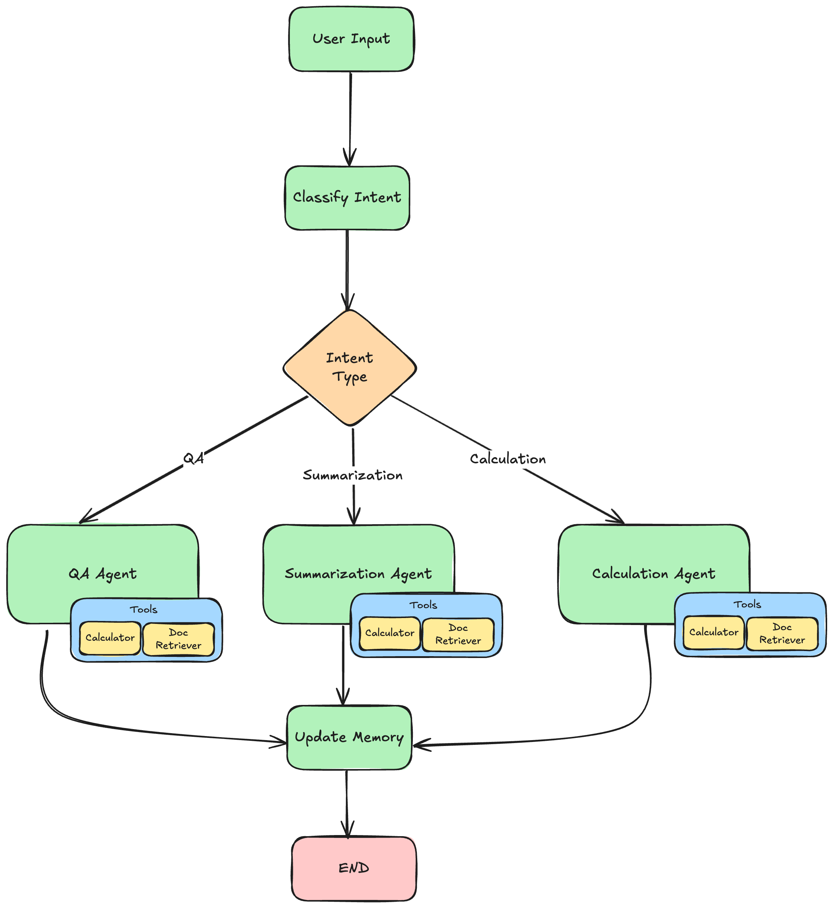

# Document Assistant Project Instructions

Welcome to the Document Assistant project! This project will help you build a sophisticated document processing system using LangChain and LangGraph. You'll create an AI assistant that can answer questions, summarize documents, and perform calculations on financial and healthcare documents.

## Project Overview

This document assistant uses a multi-agent architecture with LangGraph to handle different types of user requests:
- **Q&A Agent**: Answers specific questions about document content
- **Summarization Agent**: Creates summaries and extracts key points from documents
- **Calculation Agent**: Performs mathematical operations on document data

### Prerequisites
- Python 3.9+
- OpenAI API key

### Installation

1. Clone the repository:
```bash
cd <repository_path>
```

2. Create a virtual environment:
```bash
python -m venv venv
source venv/bin/activate  # On Windows: venv\Scripts\activate
```

3. Install dependencies:
```bash
pip install -r requirements.txt
```

4. Create a `.env` file:
```bash
cp .env.example .env
# Edit .env and add your OpenAI API key
```

### Running the Assistant

```bash
python main.py
```

## Project Structure
```
doc_assistant_project/
├── src/
│   ├── schemas.py        # Pydantic models
│   ├── retrieval.py      # Document retrieval
│   ├── tools.py          # Agent tools
│   ├── prompts.py        # Prompt templates
│   ├── agent.py          # LangGraph workflow
│   └── assistant.py      # Main agent
├── sessions/             # Saved conversation sessions
├── main.py               # Entry point
├── requirements.txt      # Dependencies
└── README.md             # This file
```


## Agent Architecture

The LangGraph agent follows this workflow:



## Implementation Tasks

### 1. Schema Implementation (schemas.py)

#### Task 1.1: AnswerResponse Schema
Create a Pydantic model for structured Q&A responses with the following fields:
- `question`: The original user question (string)
- `answer`: The generated answer (string)
- `sources`: List of source document IDs used (list of strings)
- `confidence`: Confidence score between 0 and 1 (float)
- `timestamp`: When the response was generated (datetime)

**Purpose**: This schema ensures consistent formatting of answers and tracks which documents were referenced.

#### Task 1.2: UserIntent Schema
Create a Pydantic model for intent classification with these fields:
- `intent_type`: The classified intent ("qa", "summarization", "calculation", or "unknown")
- `confidence`: Confidence in classification (float between 0 and 1)
- `reasoning`: Explanation for the classification (string)

**Purpose**: This schema helps the system understand what type of request the user is making and route it to the appropriate agent.

### 2. Agent State Implementation (agent.py)

#### Task 2.1: AgentState Properties
The `AgentState` class is already defined, but you need to understand its structure:
- `messages`: Conversation messages with LangGraph message annotation
- `user_input`: Current user input
- `intent`: Classified user intent
- `next_step`: Next node to execute in the graph
- `conversation_history`: Previous conversation turns
- `conversation_summary`: Summary of recent conversation
- `active_documents`: Document IDs currently being discussed
- `current_response`: The response being built
- `tools_used`: List of tools used in current turn
- `session_id` and `user_id`: Session management

#### Task 2.2: Intent Classification Function
Implement the `classify_intent` function that:
1. Formats the conversation history for context
2. Uses the LLM with structured output to classify the user's intent
3. Sets the `next_step` based on the classified intent:
   - "qa" --> "qa_agent"
   - "summarization" --> "summarization_agent"
   - "calculation" --> "calculation_agent"
   - default --> "qa_agent"

**Key concepts**: 
- Use `llm.with_structured_output(UserIntent)` for structured responses
- Include conversation history for better context understanding
- The function should return the updated state

#### Task 2.3: Calculation Agent Completion
Complete the `calculation_agent` function by implementing the final response generation:
1. Use `llm.with_structured_output(CalculationResponse)` to get a structured response
2. Create a prompt asking for a clear explanation of the calculation
3. Ensure the response includes the expression and step-by-step explanation
4. Update the state with the response and return it

#### Task 2.4: Memory Update Function
Implement the `update_memory` function that:
1. Creates a `ConversationTurn` object from the current interaction
2. Adds the turn to the conversation history
3. Updates the message history with user input and agent response
4. Tracks active documents from the response
5. Sets `next_step` to "end"

**Purpose**: This function maintains conversation context and tracks document references across turns.

#### Task 2.5: Workflow Creation
Implement the `create_workflow` function that:
1. Creates a `StateGraph` with the `AgentState`
2. Adds all agent nodes (classify_intent, qa_agent, summarization_agent, calculation_agent, update_memory)
3. Sets "classify_intent" as the entry point
4. Adds conditional edges from classify_intent to the appropriate agents
5. Adds edges from each agent to update_memory
6. Adds edge from update_memory to END
7. Returns the compiled workflow

**Graph Structure**:
```
classify_intent --> [qa_agent|summarization_agent|calculation_agent] --> update_memory --> END
```

### 3. Prompt Implementation (prompts.py)

#### Task 3.1: Intent Classification Prompt
Implement the `get_intent_classification_prompt` function that returns a `PromptTemplate` with:
- Input variables: `["user_input", "conversation_history"]`
- Template that instructs the LLM to classify intent into qa, summarization, calculation, or unknown
- Clear examples and guidelines for each intent type
- Instructions to provide confidence score and reasoning

**Purpose**: This prompt helps the LLM accurately classify user intents for proper routing.

#### Task 3.2: Chat Prompt Template
Implement the `get_chat_prompt_template` function that:
1. Takes an `intent_type` parameter
2. Selects the appropriate system prompt based on intent type
3. Returns a `ChatPromptTemplate` with system message, chat history placeholder, and human message
4. Uses the existing system prompts (QA_SYSTEM_PROMPT, SUMMARIZATION_SYSTEM_PROMPT, CALCULATION_SYSTEM_PROMPT)

**Purpose**: This provides context-aware prompts for different types of tasks.

### 4. Tool Implementation (tools.py)

#### Task 4.1: Calculator Tool
Implement the `create_calculator_tool` function that:
1. Uses the `@tool` decorator to create a LangChain tool
2. Takes a mathematical expression as input
3. Validates the expression for safety (only allow basic math operations)
4. Evaluates the expression using Python's `eval()` function
5. Logs the tool usage with the ToolLogger
6. Returns a formatted result string
7. Handles errors gracefully

## Key Concepts for Success

### 1. LangChain Tool Pattern
Tools are functions decorated with `@tool` that can be called by LLMs. They must:
- Have clear docstrings describing their purpose and parameters
- Handle errors gracefully
- Return string results
- Log their usage for debugging

### 2. LangGraph State Management
The state flows through nodes and gets updated at each step. Key principles:
- Always return the updated state from node functions
- Use the state to pass information between nodes
- The state persists conversation context and intermediate results

### 3. Structured Output
Use `llm.with_structured_output(YourSchema)` to get reliable, typed responses from LLMs instead of parsing strings.

### 4. Conversation Memory
The system maintains conversation context by:
- Storing conversation turns with metadata
- Tracking active documents
- Summarizing long conversations
- Providing context to subsequent requests

## Testing Your Implementation

1. **Unit Testing**: Test individual functions with sample inputs
2. **Integration Testing**: Test the complete workflow with various user inputs
3. **Edge Cases**: Test error handling and edge cases

## Common Pitfalls to Avoid

1. **Missing Error Handling**: Always wrap external calls in try-catch blocks
2. **Incorrect State Updates**: Ensure you're updating and returning the state correctly
3. **Prompt Engineering**: Make sure your prompts are clear and specific
4. **Tool Security**: Validate all inputs to prevent security issues

## Expected Behavior

After implementation, your assistant should be able to:
- Classify user intents correctly
- Search and retrieve relevant documents
- Answer questions with proper source citations
- Generate comprehensive summaries
- Perform calculations on document data
- Maintain conversation context across turns

Good luck with your implementation! Remember to test thoroughly and refer to the existing working code for guidance on patterns and best practices.